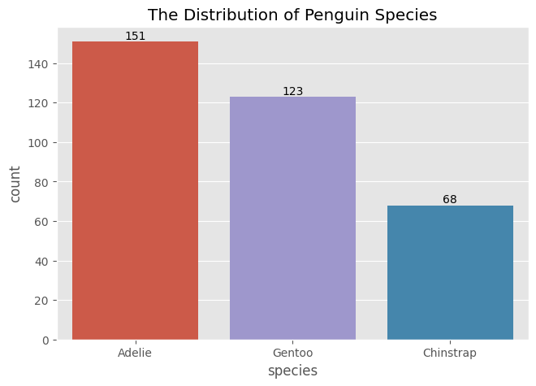
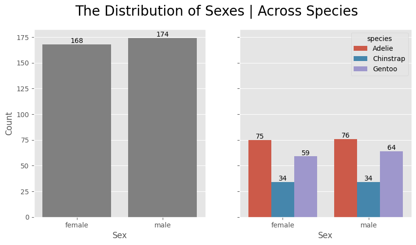
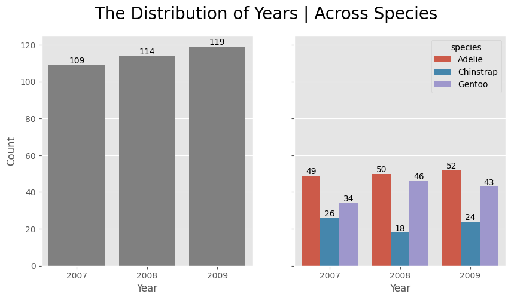
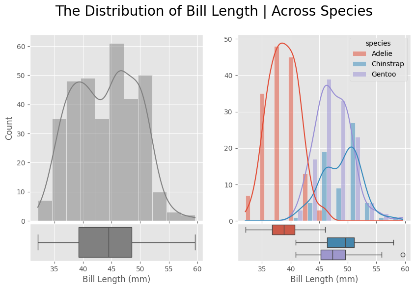
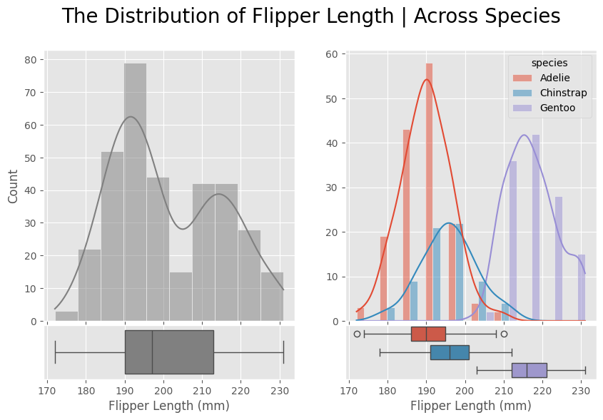
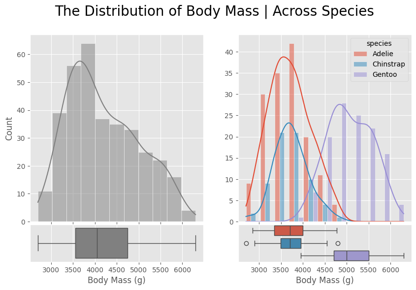
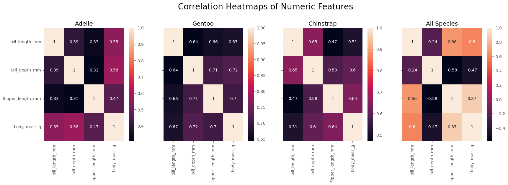
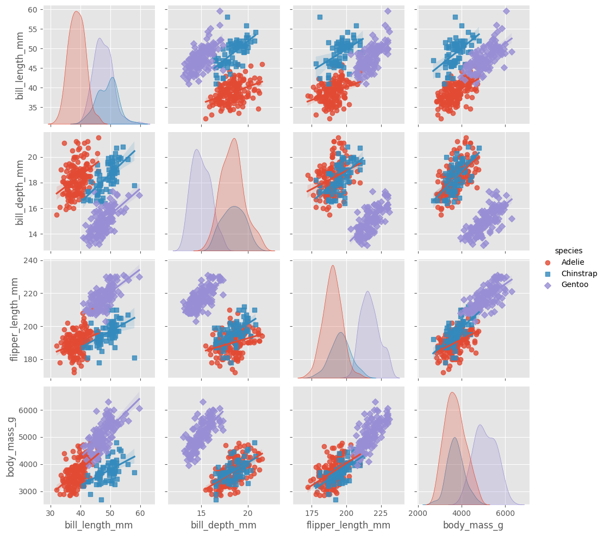

# Introduction
This report provides a comprehensive analysis of a penguin dataset with the goal of classifying penguin species using machine learning models. The study employs clustering and classification techniques, including KMeans, Decision Tree, Support Vector Machine, and Logistic Regression, with extensive hyperparameter tuning through GridSearchCV. The performance of each model is meticulously evaluated using metrics such as accuracy, precision, recall, and confusion matrices, providing insight into the predictability and distinguishability of penguin species based on morphological traits.

# Preparation
The dataset comprises morphological measurements such as bill length, bill depth, flipper length, and body mass from three penguin species: Adelie, Chinstrap, and Gentoo.

## Data Validation
A preliminary examination of the dataset reveals missing values in the `bill_length_mm`, `bill_depth_mm`, `flipper_length_mm`, `body_mass`, and `sex` columns. Otherwise the dataset is as expected, with 344 rows and 8 columns. These are:
- `species`: 3 species without missing values, **Adelie** (152), **Chinstrap** (68), and **Gentoo** (124). No cleaning is needed.
- `island`: 3 islands without missing values, **Biscoe** (168), **Dream** (124), and **Torgersen** (52). No cleaning is needed.
- `bill_length_mm`: numeric values (float64) with 2 missing values. Missing values can be filled with the mean value.
- `bill_depth_mm`: numeric values (float64) with 2 missing values. Missing values can be filled with the mean value.
- `flipper_length_mm`: numeric values (float64) with 2 missing values. Missing values can be filled with the mean value.
- `body_mass_g`: numeric values (float64) with 2 missing values. Missing values can be filled with the mean
- `sex`: 2 sexes with 11 missing values, **male** (168) and **female** (165). Missing values can be filled with the mode value.
- `year`: 3 years without missing values, **2009** (120), **2008** (114), **2007** (110). No cleaning is needed.

## Exploratory Analysis
### Target variable - `species`
Since we need to predict the species of the penguins, the `species` column is the target variable. From the bar chart below, class imbalance is observed in the target variable. The **Adelie** species has the most samples, followed by the **Gentoo** species, and the **Chinstrap** species has the least samples. I will use the SMOTE technique to balance the classes for the classification models.
### Categorical Variables - `island`, `sex`, `year`
- The `island` column has three categories, **Biscoe**, **Dream**, and **Torgersen**. The **Biscoe** island has the most samples (167), followed by the **Dream** island (124), and the **Torgersen** island has the least samples (51). The **Adelie** species is observed in all three islands, the **Gentoo** species is observed in the **Biscoe** island, and the **Chinstrap** species is observed in the **Dream** island.

- The `sex` column has two categories. **female** and **male**. The **male** category has more samples (174) than the **female** category (168). The species are more or less equally distributed across the sexes.

- The `year` column has three categories, **2007**, **2008**, and **2009**. The **2009** year has the most samples (120), followed by the **2008** year (114), and the **2007** year has the least samples (110). Again, the numbers are more or less equally distributed across the species.

### Numeric Variables - `bill_length_mm`, `bill_depth_mm`, `flipper_length_mm`, `body_mass_g`
#### Univariate Analysis
##### Bill Length
- The left plot shows the overall distribution of bill length, suggesting a bimodal distribution where two different size ranges are common.
- The right plot breaks this down by species. Adelie penguins have the shortest bills, Gentoo bills are longer, and Chinstrap bills have the most significant variance in length.

##### Bill Depth
- The left plot shows the overall distribution of bill depth, indicating a unimodal distribution that slightly skews right.
- The right plot differentiates by species. Adelie penguins have deeper bills compared to the other two species, with Chinstrap and Gentoo having similar distributions but shifted; Chinstraps have slightly deeper bills than Gentoos.

##### Flipper Length
- The left plot indicates a unimodal distribution with a slight right skew.
- The right plot shows that Adelie penguins have shorter flippers, Gentoos have the longest, and Chinstraps fall in between. The Gentoo distribution is also more spread out, indicating greater variability.

##### Body Mass
- The left plot illustrates a unimodal distribution for body mass.
- In the right plot, Adelie penguins are lighter, Chinstrap are slightly heavier, and Gentoo are the heaviest, with a broad range of weights.

These plots provide insights into the morphological differences between the penguin species, which could be used for studies on species identification, adaptation, and ecological niche differentiation. The density curves show the distribution shapes, while the box plots provide a summary of the distribution statistics. The presence of outliers in some of the box plots (notably for flipper length) suggests that there are some penguins with measurements that are notably different from the typical range for their species.

#### Bivariate Analysis

The heatmaps provided depict the correlation coefficients between various numeric features of penguin data for Adelie, Gentoo, and Chinstrap species, as well as for all species combined. These coefficients range from -1 to 1, where 1 indicates a perfect positive correlation, -1 indicates a perfect negative correlation, and 0 indicates no correlation.

The heatmaps reveal the following insights:

1. Adelie Penguins:

    - Moderate positive correlations between bill length and body mass, and bill depth and body mass suggest that larger Adelies tend to have longer and deeper bills.
    - Other traits show weaker positive correlations with each other, indicating less pronounced relationships.

2. Gentoo Penguins:

    - High positive correlations are observed across all features, particularly between bill depth and flipper length, and bill depth and body mass. This suggests that for Gentoos, larger individuals have proportionately larger features.

3. Chinstrap Penguins:

    - Positive correlations are present, with the strongest being between bill length and flipper length, and between bill depth and body mass. These correlations are not as strong as in Gentoos, indicating more variability.

4. All Species:

    - When all species are considered, the correlations between bill dimensions and other traits are negative, which likely reflects the differences in morphology between species more than variations within a species.
    - Strong positive correlations are found between flipper length and body mass, indicating that, regardless of species, larger penguins have longer flippers.

Overall, the heatmap suggests that body size traits (bill size, flipper length, body mass) are positively correlated within species, indicating that larger penguins tend to have larger characteristic features. When combining data from all species, the negative correlations between bill size and other features suggest that species differences are a strong factor, possibly overshadowing within-species variation.

The following scatterplot matrix, provides a visual representation of the relationships between bill length, bill depth, flipper length, and body mass across three different penguin species: Adelie, Chinstrap, and Gentoo.

The diagonal of the matrix shows the distribution of each variable as a histogram for each species, providing insight into the distribution shape and spread. Off-diagonal elements are scatterplots that represent the pairwise relationships between the different variables for each species.

**Distributions (Diagonal):**

Bill length and bill depth show distinct peaks for each species, which could be used for species identification.
Flipper length distributions for Chinstrap and Adelie overlap significantly, while Gentoo penguins have distinctly longer flippers.
Body mass distribution shows clear differences, with Gentoos being heavier than the other species.

**Pairwise Relationships (Off-Diagonal):**

The bill length and bill depth scatterplots indicate different patterns for each species, suggesting that these measures can be used to differentiate between species.
There is a positive correlation between flipper length and body mass, particularly strong in Gentoo penguins, which aligns with the correlation heatmap you previously provided.
Scatterplots show varying degrees of correlation between the variables, with some pairs showing tighter clusters and more defined trends than others.

**Species Differentiation:**

Adelie penguins (red dots) tend to have shorter and deeper bills, shorter flippers, and lower body mass.
Chinstrap penguins (purple dots) have longer bills than Adelies, their flipper length is similar to Adelies, and their body mass is also similar but slightly higher on average.
Gentoo penguins (blue squares) stand out with the longest flipper length and the highest body mass. Their bills are intermediate in length and less deep than Adelies.

# Model Fitting & Evaluation
## Methodology
Predicting the species is a classification problem in machine learning. I am taking two approaches:
1. **Clustering** - This is an unsupervised learning technique where the model groups similar data points together. I will use the KMeans algorithm to cluster the penguins based on their features.
2. **Classification** - This is a supervised learning technique where the model learns from the data and predicts the target variable. I will use the following classification algorithms:
    - Decision Tree:
        - The Decision Tree model is a simple model that is easy to interpret. It is a white-box model that can be visualized. It is also robust to outliers.
    - Support Vector Machine:
        - The Support Vector Machine model is a powerful model that can handle non-linear data. It is also robust to overfitting. To interpret the model and understand the importance of each feature, I will use the coefficients of the features. I will also use the support vectors to understand the effect of each feature on the decision boundary.
    - Logistic Regression:
        - The Logistic Regression model is a simple model that is easy to interpret. It is also robust to overfitting. To interpret the model, I will use the coefficients of the features to understand the importance of each feature in predicting the target variable. I will also use the odds ratio to understand the effect of each feature on the odds of predicting the target variable.

Using `GridSearchCV`, I will tune the hyperparameters of the models to improve their performance.

I will evaluate the models using the following metrics:
- Confusion Matrix: A table that shows the number of true positives, false positives, true negatives, and false negatives. It is a good metric to understand the performance of the model.
- Accuracy: The proportion of correctly classified instances. It is a good metric when the classes are balanced.
- Precision: The proportion of correctly classified instances among the predicted positive instances. It is a good metric when the cost of false positives is high.
- Recall: The proportion of correctly classified instances among the actual positive instances. It is a good metric when the cost of false negatives is high.

## Data Preprocessing
To enable modelling, I have applied the following changes to the data set:
- Filled missing values in the `sex` column with random values weighted by the ratio of each category.
- Dropped missing values in the `bill_length_mm`, `bill_depth_mm`, `flipper_length_mm`, and `body_mass_g` columns
- Converted the categorical variables into numeric features
- Scaled the numeric features
- Split the data into a training set and a test set
- Balanced the classes in the `species` column using the SMOTE technique. This was only performed on the training set to maintain the integrity of the test set.
# Results
The classification models performed exceptionally well, achieving high accuracy, precision, and recall scores. The models were able to correctly classify the species with high accuracy, indicating that the morphological features of the penguins are highly predictive of their species. The Support Vector Machine and Logistic Regression models achieved perfect accuracy, precision, and recall scores, indicating that they are highly effective in predicting the species of the penguins. The Decision Tree model also performed well, achieving high accuracy, precision, and recall scores. The results demonstrate that the models are effective in classifying the penguin species based on their morphological features.

## Clustering
The KMeans algorithm was used to cluster the penguins based on their features. The clustering was performed on the scaled features. The results are as follows:
- The clustering algorithm achieved an **accuracy** of 0.68, a **precision** of 0.72, and a **recall** of 0.68.
- Confusion matrix:

    |  | Adelie (pred)| Chinstrap (pred)| Gentoo (pred)|
    |---|---|---|---|
    | Adelie | 75 | 76 | 0 |
    | Chinstrap | 34 | 34 | 0 |
    | Gentoo | 0 | 0 | 123 |
- The confusion matrix shows that the model was able to correctly classify the **Gentoo** species but had difficulty classifying the **Adelie** and **Chinstrap** species. This is likely due to the overlap in the features of the **Adelie** and **Chinstrap** species.

## Classification
The Decision Tree, Support Vector Machine, and Logistic Regression models were used to predict the species of the penguins. The models were trained on the training set and evaluated on the test set. The results are as follows:
- **Decision Tree**:

    The Decision Tree model achieved an **accuracy** of 0.97, a **precision** of 0.97, and a **recall** of 0.97.
    
    Confusion matrix:

    |  | Adelie (pred)| Chinstrap (pred)| Gentoo (pred)|
    |---|---|---|---|
    | Adelie | 33 | 1 | 1 |
    | Chinstrap | 0 | 11 | 0 |
    | Gentoo | 0 | 0 | 23 |

    The confusion matrix shows that the model was able to correctly classify the species with high accuracy.

- **Support Vector Machine**:

    The Support Vector Machine model achieved an **accuracy** of 1.00, a **precision** of 1.00, and a **recall** of 1.00.
    
    Confusion matrix:

    |  | Adelie (pred)| Chinstrap (pred)| Gentoo (pred)|
    |---|---|---|---|
    | Adelie | 35 | 0 | 0 |
    | Chinstrap |  | 11 | 0 |
    | Gentoo | 0 | 0 | 35 |

    The confusion matrix shows that the model was able to correctly classify the species with high accuracy.

- **Logistic Regression**

    The Logistic Regression model achieved an **accuracy** of 1.00, a **precision** of 1.00, and a **recall** of 1.00.
    
    Confusion matrix:

    |  | Adelie (pred)| Chinstrap (pred)| Gentoo (pred)|
    |---|---|---|---|
    | Adelie | 35 | 0 | 0 |
    | Chinstrap | 0 | 11 | 0 |
    | Gentoo | 0 | 0 | 35 |

    The confusion matrix shows that the model was able to correctly classify the species with high accuracy.

